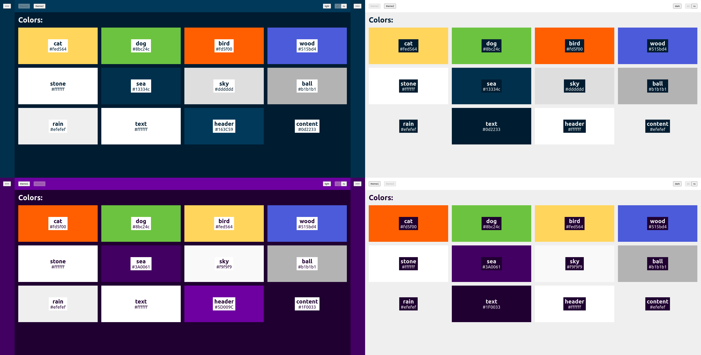

# UI Library Starter 2

 

Стартовый пример для быстрого создания переиспользуемых модулей-библиотек с состоянием, темезацией, локализацией, документацией и режимом разработки (на Vue3+TS/Vuex4/VuePress2/i18n)
-----------------------------------------------------------------------------------------------------------------------------------------------------

В отличие от более примитивной первой версии, этот модуль:

- Использует хранилище, то есть содержит состояние

- Может запускаться в полноценном режиме разработки, как будто это собственно уже сам конечный проект

- Поддерживает темизацию и локализацию

Пример модуля содержит совсем немного компонент и документация на свежей версии VuePress, в отличие от первой версии модуля, не кастомизируется под фирменный стиль который предоставляет сама библиотека. Так сделано не только по причине лени и экономии времени, но, прежде всего, потому что кажется излишним — то что призваны продемонстрировать примеры — этого совсем не требует.

[Пример использующего модуль проекта - репо](https://github.com/ushliypakostnik/ui-library-2-test)

[Пример использующего модуль проекта - демостенд](https://ui-library-2-test.vercel.app/)
