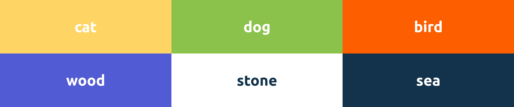

# UI Library Starter 2

 

Стартовый пример для быстрого создания переиспользуемых модулей-библиотек с состоянием, темезацией, локализацией, документацией и режимом разработки (на Vue3+TS/Vuex4/VuePress2)
-----------------------------------------------------------------------------------------------------------------------------------------------------
